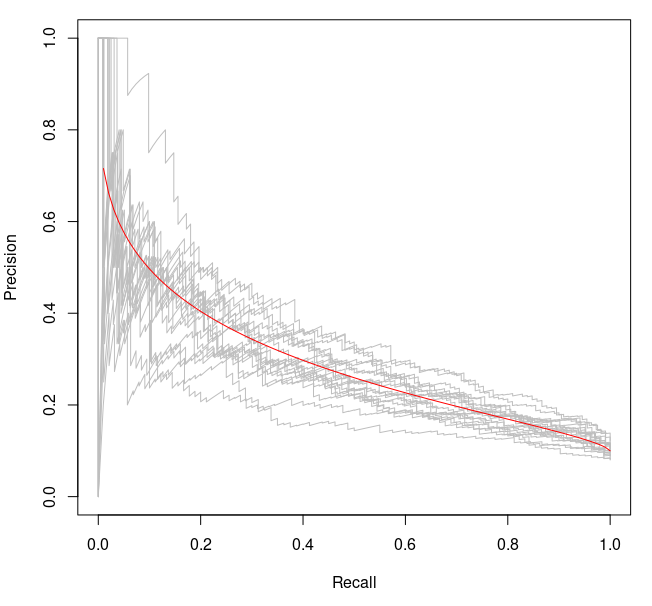
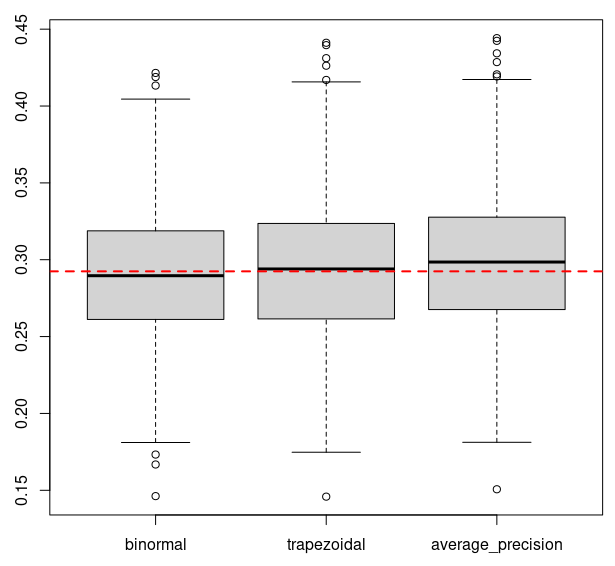

prc library
===========

prc implements a few functions to compute
[Precision-Recall](https://en.wikipedia.org/wiki/Precision_and_recall)
curves, and their AUC (area under curve). The implementation is
checked against [scikit-learn](https://scikit-learn.org/).

## Installation

Latest release
```
opam install prc
```

Latest commit
```
opam pin add -y prc https://github.com/pveber/prc.git
```

## Motivation

Precision-Recall curves are a useful representation of the performance
of binary classification methods in the case there are many negative
items. Problem is they are difficult to estimate from a finite
sample. As an illustration, compare the following graph obtained in
a particular case where the true precision-recall curve can be
computed analytically (so-called binormal model):



The red curve shows the "true" precision-recall curve while the grey
ones are the empirical estimated obtained from samples of
size 1000. We see that there is a lot of variability, particularly in
the low-recall region.

As a consequence, displaying a precision-recall curve can be
misleading, and it is safer to report an estimate of its area under
curve (AUC) along with a confidence interval. This is what this
library provides.

## Quick test

Demo code is available in the `demo` directory. To run it, simply
launch an interpreter via a `dune utop demo` command, and then call
functions in `Prc_demo`. For instance to get an overview of the
sampling distribution of several estimators under the binormal model,
just type:
```ocaml
# Prc_demo.estimator_sampling_distribution ~sample_size:1000 ();;
``` This yields:



where each boxplot represents the distribution of an estimator
(resp. binormal, trapezoidal and average precision) for a binormal
model when drawing finite samples of size 1000.
