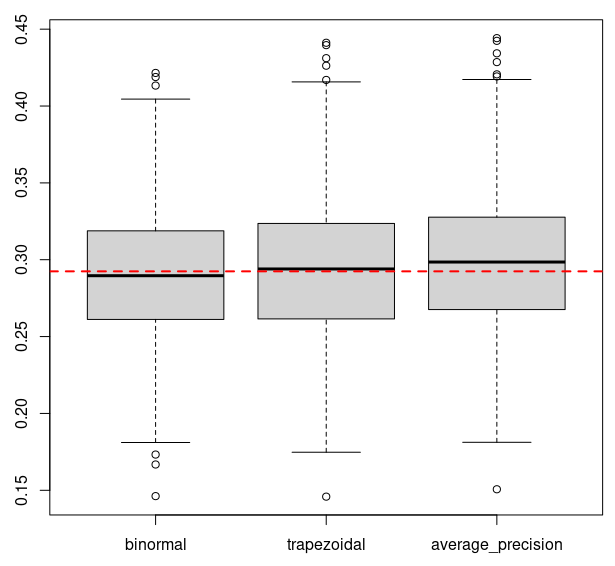

prc library
===========

prc implements a few functions to compute
[Precision-Recall](https://en.wikipedia.org/wiki/Precision_and_recall)
curves, and their AUC (area under curve). The implementation is
checked against [scikit-learn](https://scikit-learn.org/).

## Installation

Latest release
```
opam install prc
```

Latest commit
```
opam pin add -y prc https://github.com/pveber/prc.git
```

## Quick test

Demo code is available in the `demo` directory. To run it, simply
launch an interpreter via a `dune utop demo` command, and then call
functions in `Prc_demo.Check`. For instance to get an overview of the
sampling distribution of several estimators under the binormal model,
just type:
```ocaml
# Prc_demo.Check.binormal_simulation ~sample_size:1000 ();;
```
This yields:

